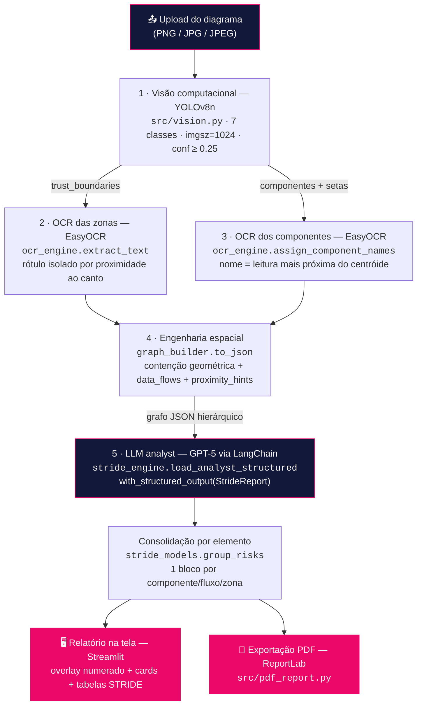

# 🛡️ STRIDE-AI — Modelagem de Ameaças com Inteligência Artificial

> **STRIDE-AI** by **FIAP Software Security**
> *"Todo diagrama esconde um ponto de falha. Nós o desenhamos de volta."*

Solução desenvolvida para o **Hackathon da Pós-Tech FIAP (IA para Devs — Fase 5)**: uma IA que recebe a **imagem de um diagrama de arquitetura cloud** (AWS, Azure ou GCP), identifica automaticamente seus componentes e produz um **Relatório de Modelagem de Ameaças baseado na metodologia STRIDE** — com justificativa técnica, impacto, severidade e **contramedida prescritiva para cada risco**, tudo **rastreável visualmente** até o ponto exato do diagrama.

---

## 📌 Sumário

- [O desafio (proposta do Hackathon)](#-o-desafio-proposta-do-hackathon)
- [O que a ferramenta entrega](#-o-que-a-ferramenta-entrega)
- [Arquitetura da solução](#%EF%B8%8F-arquitetura-da-solução)
- [Topologia do repositório](#%EF%B8%8F-topologia-do-repositório)
- [Tecnologias embarcadas](#-tecnologias-embarcadas)
- [Dataset e treinamento do modelo](#-dataset-e-treinamento-do-modelo)
- [A metodologia STRIDE no produto](#-a-metodologia-stride-no-produto)
- [Como executar](#-como-executar)
- [Testes](#-testes)
- [Limitações conhecidas e decisões de engenharia](#%EF%B8%8F-limitações-conhecidas-e-decisões-de-engenharia)

---

## 🎯 O desafio (proposta do Hackathon)

A **FIAP Software Security**, empresa fictícia de Segurança de Sistemas, quer validar a viabilidade de uma nova feature para seu software de análise de vulnerabilidades: usar IA para **automatizar a modelagem de ameaças (threat modeling)** a partir de um diagrama de arquitetura em imagem, aplicando a metodologia **STRIDE**. Este repositório é o **MVP de detecção supervisionada de ameaças** pedido pelo enunciado.

Mapeamento objetivo do edital → entrega no repositório:

| Objetivo do Hackathon | Onde está neste repositório |
|---|---|
| IA que interpreta o diagrama e identifica componentes (usuários, servidores, bases de dados, APIs…) | Modelo **YOLOv8n** treinado ([train.py](train.py), pesos em [models/best.pt](models/best.pt), inferência em [src/vision.py](src/vision.py)) |
| Construir/buscar um dataset de imagens de arquitetura de software | [dataset/](dataset/) — 439 imagens de diagramas reais AWS/Azure/GCP (Roboflow, licença CC BY 4.0) |
| Anotar o dataset para treino supervisionado | Anotações em formato YOLOv8, **7 classes** ([dataset/data.yaml](dataset/data.yaml)) |
| Treinar o modelo | [train.py](train.py) — fine-tuning do YOLOv8 Nano, 100 épocas, `imgsz=1024` |
| Gerar Relatório de Modelagem de Ameaças (STRIDE) | LLM *analyst* com saída estruturada ([src/prompts.py](src/prompts.py), [src/stride_engine.py](src/stride_engine.py), [src/stride_models.py](src/stride_models.py)) + relatório na tela e em **PDF** |
| Sistema que busca vulnerabilidades por componente e contramedidas específicas | Cada risco do parecer traz **justificativa, impacto, severidade e contramedida técnica prescritiva**, ancorados no elemento afetado do grafo |

---

## ✨ O que a ferramenta entrega

1. **Upload de um diagrama** (PNG/JPG/JPEG) numa interface web com identidade visual própria.
2. **Detecção dos componentes** por visão computacional: atores, gateways de API, computação, bancos/armazenamento, segurança de rede, setas de fluxo de dados e **zonas de confiança** (trust boundaries).
3. **Leitura dos rótulos reais por OCR** — o parecer cita "Amazon Lambda" ou "Redshift", não "componente c4".
4. **Grafo hierárquico em JSON** da arquitetura: quem está dentro de qual zona, quem se comunica com quem.
5. **Parecer STRIDE consolidado por elemento**, ordenado por severidade, com uma tabela de ameaças por componente/fluxo/zona.
6. **Rastreabilidade visual**: um mapa numerado de riscos sobre o diagrama original + um recorte destacado do elemento afetado em cada bloco do relatório.
7. **Exportação em PDF** com a mesma identidade visual (tema claro/editorial para impressão).
8. **Barra de progresso com ETA calibrado** pelo histórico de execuções da máquina — feedback contínuo mesmo durante a análise longa do LLM.

---

## 🏗️ Arquitetura da solução

O pipeline é **síncrono e encadeado em 5 etapas** — ao clicar em "Analisar diagrama", a imagem percorre visão → OCR → grafo → LLM, e o parecer é renderizado:



### As 5 etapas em detalhe

**1 · Visão computacional ([src/vision.py](src/vision.py))** — O modelo YOLOv8 Nano (fine-tuned neste projeto) detecta as 7 classes do diagrama. A inferência roda em **RGB** (a cor é sinal semântico forte em ícones cloud: compute, database e storage se distinguem primariamente pela cor) com `imgsz=1024` — o mesmo tamanho do treino — e filtro global de confiança de **25%**, calibrado para cortar o ruído da classe `data_flow` (a mais instável do modelo). As detecções são separadas em duas listas: `trust_boundaries` e demais componentes.

**2 · OCR das zonas ([src/ocr_engine.py](src/ocr_engine.py))** — Em vez de rodar OCR na imagem inteira, cada `trust_boundary` é **recortada** e só o recorte vai ao EasyOCR (menos ruído, menos custo). Recortes com menos de 200 px de altura são ampliados antes da leitura. O **rótulo oficial da zona** (ex.: "VPC", "Backend Systems") é isolado por **proximidade vetorial ao canto superior-esquerdo** do recorte — a convenção de diagramas AWS/Azure/GCP para nomear fronteiras.

**3 · OCR dos componentes ([src/ocr_engine.py](src/ocr_engine.py))** — O YOLO detecta o **ícone**, mas o nome do serviço fica **fora** do bbox (ao lado/abaixo). A solução reúne todas as leituras de OCR da imagem num pool de coordenadas absolutas e associa a cada componente a leitura **mais próxima do seu centróide**, com limiar de distância proporcional à **diagonal da imagem** (escala com a resolução) e confiança mínima de 0.3.

**4 · Engenharia espacial ([src/graph_builder.py](src/graph_builder.py))** — Matemática pura, sem ML:
- **Contenção geométrica**: o centróide de cada componente é testado contra os retângulos das zonas (ponto-em-retângulo); com zonas aninhadas, vence a de **menor área** (a mais específica).
- **`data_flows`**: cada seta detectada é ligada aos **2 nós conectáveis mais próximos** dos cantos do seu bbox. As conexões são **não-direcionadas** — o modelo não distingue origem de destino, e o prompt instrui o LLM a avaliar os dois sentidos.
- **`proximity_hints`**: sinal **complementar e deliberadamente mais fraco** — pares de componentes fisicamente próximos dentro da mesma zona para os quais **não** foi detectada seta (KNN com teto e piso de distância como fração da diagonal, dedup contra os data_flows). Recupera relações que o detector de setas perdeu, sem tratá-las como comunicação confirmada.

O resultado é um **JSON hierárquico**: zonas nomeadas com seus componentes aninhados, componentes órfãos (`unassigned_components`), fluxos e hints.

**5 · Análise STRIDE por LLM ([src/stride_engine.py](src/stride_engine.py), [src/prompts.py](src/prompts.py))** — O motor define dois papéis via LangChain: `rewriter` (**GPT-4o**, apoio à interpretação de dados brutos) e `analyst` (**GPT-5**, modelo de reasoning que elabora o parecer final). O *analyst* recebe um system prompt de **arquiteto DevSecOps sênior** e o grafo JSON como mensagem, e é envolvido por `with_structured_output(StrideReport)`: a resposta **não é texto livre**, é um objeto Pydantic validado — uma lista de riscos em que **cada risco aponta o `id` exato do elemento afetado no grafo**. Esse vínculo `id → bounding box` é o que sustenta a rastreabilidade visual (risco → recorte do diagrama). Como a chamada leva minutos, ela roda numa *thread* separada enquanto a barra de progresso anima contra o ETA histórico.

### Camada de apresentação

- [src/main.py](src/main.py) — app **Streamlit** que orquestra o pipeline e renderiza o parecer.
- [src/visual_report.py](src/visual_report.py) — desenha os overlays: caixas coloridas por classe, linhas tracejadas de proximity_hints, **mapa numerado de riscos** e o **recorte destacado** (600×400) de cada elemento afetado.
- [src/stride_models.py](src/stride_models.py) — além do schema, consolida os riscos **por elemento arquitetural** (`group_risks`): um API Gateway com 4 ameaças STRIDE vira **um bloco** com uma imagem e uma tabela de 4 linhas, ordenado pela pior severidade.
- [src/pdf_report.py](src/pdf_report.py) — gera o PDF com **ReportLab** a partir dos mesmos dados da tela (sem recálculo), em tema claro/editorial.
- [src/branding.py](src/branding.py) + [src/theme.py](src/theme.py) + [.streamlit/config.toml](.streamlit/config.toml) — identidade visual da marca (ver [Tecnologias](#-tecnologias-embarcadas)).
- [src/progress.py](src/progress.py) — barra de progresso com ETA: cada etapa ocupa uma fatia proporcional ao seu tempo médio histórico, persistido em `.stride_timings.json` (média móvel calibrada ao hardware do usuário).

---

## 🗂️ Topologia do repositório

```
hackathon-stride-ai/
├── .env.example              # Template de credenciais (OPENAI_API_KEY)
├── .streamlit/
│   └── config.toml           # Tema dark com os tokens da marca
├── dataset/                  # Dataset YOLOv8 (Roboflow, CC BY 4.0)
│   ├── data.yaml             # 7 classes + splits
│   ├── train/                # 420 imagens (44 imagens-base × ~10 augmentations)
│   ├── valid/                # 13 imagens
│   └── test/                 # 6 imagens
├── models/
│   └── best.pt               # Pesos YOLOv8n treinados (modelo do produto)
├── src/
│   ├── main.py               # 🖥️ App Streamlit — orquestra o pipeline completo
│   ├── vision.py             # 1️⃣ Inferência YOLO (detecção das 7 classes)
│   ├── ocr_engine.py         # 2️⃣3️⃣ OCR direcionado (EasyOCR): zonas + nomes
│   ├── graph_builder.py      # 4️⃣ Grafo hierárquico (contenção, fluxos, hints)
│   ├── prompts.py            # 5️⃣ System prompt do analista DevSecOps
│   ├── stride_engine.py      # 5️⃣ Clientes LLM (LangChain + saída estruturada)
│   ├── stride_models.py      # Schema Pydantic do parecer + consolidação
│   ├── visual_report.py      # Overlays, mapa numerado, recortes de risco
│   ├── pdf_report.py         # Exportação do parecer em PDF (ReportLab)
│   ├── progress.py           # Barra de progresso com ETA histórico
│   ├── branding.py           # CSS injetado da marca (hero, pills, tabelas)
│   └── theme.py              # Fonte única da paleta (tokens de cor)
├── tests/                    # 53 testes unitários (pytest)
├── train.py                  # Treinamento do YOLOv8n (100 épocas, imgsz=1024)
├── runs_train.log            # Log de treinamento (histórico de execução)
├── requirements.txt          # Dependências de produção
└── requirements-dev.txt      # + pytest
```

---

## 🧰 Tecnologias embarcadas

| Tecnologia | Papel na solução | Onde |
|---|---|---|
| **YOLOv8 Nano** (Ultralytics + PyTorch) | Detecção supervisionada dos componentes do diagrama (7 classes), fine-tuned em dataset próprio | [train.py](train.py), [src/vision.py](src/vision.py), [models/best.pt](models/best.pt) |
| **EasyOCR** (+ OpenCV) | Leitura dos rótulos reais do diagrama: nome das zonas de confiança e dos serviços | [src/ocr_engine.py](src/ocr_engine.py) |
| **LangChain** (ecossistema LangChain/LangGraph) | Orquestração dos papéis de LLM e **saída estruturada** (`with_structured_output` injeta o schema Pydantic na chamada) | [src/stride_engine.py](src/stride_engine.py) |
| **LLM DevSecOps** (GPT-5 *analyst* + GPT-4o *rewriter*, via OpenAI) | Parecer STRIDE: o system prompt codifica a expertise de um arquiteto de segurança sênior | [src/prompts.py](src/prompts.py) |
| **Pydantic** | Schema tipado do parecer (`StrideReport`/`Risk`) — cada risco validado e ancorado a um id do grafo | [src/stride_models.py](src/stride_models.py) |
| **Streamlit** | Interface web: upload, progresso, relatório interativo | [src/main.py](src/main.py) |
| **HTML + CSS estruturado (identidade visual própria)** | Marca "FIAP Software Security": CSS injetado mirando `[data-testid]` do Streamlit, hero/rodapé em HTML, pills de severidade, tabelas de risco estilizadas — tokens de cor centralizados em um único módulo | [src/branding.py](src/branding.py), [src/theme.py](src/theme.py), [.streamlit/config.toml](.streamlit/config.toml) |
| **ReportLab** | Exportação do relatório em PDF com a mesma identidade (tema claro para impressão) | [src/pdf_report.py](src/pdf_report.py) |
| **NumPy / Pillow / OpenCV** | Processamento de imagem: recortes, upscale, overlays, destaque de riscos | [src/visual_report.py](src/visual_report.py), [src/ocr_engine.py](src/ocr_engine.py) |
| **Roboflow** | Anotação e versionamento do dataset (export YOLOv8) | [dataset/](dataset/) |
| **pytest** | 53 testes unitários das camadas puras | [tests/](tests/) |

> **Nota sobre identidade visual:** a paleta (ink `#050507`, navy `#12183A`, magenta `#EC0868` + 4 cores semânticas de severidade) vive em [src/theme.py](src/theme.py) como **fonte única**, consumida pela tela (CSS) e pelo PDF (ReportLab) — o hex nunca diverge entre o que a tela mostra e o que o PDF baixado mostra.

---

## 📊 Dataset e treinamento do modelo

**Dataset:** [Roboflow Universe — hackathon-vp4zy v12](https://universe.roboflow.com/gustavo-lima-vprcy/hackathon-vp4zy/dataset/12) (licença **CC BY 4.0**), construído com **diagramas de arquitetura reais de AWS, Azure e GCP**.

- **439 imagens** no total: 420 de treino (**44 imagens-base únicas** × ~10 versões de augmentation), 13 de validação e 6 de teste.
- Augmentation aplicada: flip horizontal (50%) e ajuste aleatório de brilho (±15%).
- **7 classes anotadas** (formato YOLOv8):

| Classe | O que representa |
|---|---|
| `actor` | Usuários e sistemas externos |
| `api_gateway` | Gateways/pontos de entrada de API |
| `compute` | Serviços de computação (Lambda, EC2, App Service, GKE…) |
| `data_flow` | Setas de comunicação entre componentes |
| `database_storage` | Bancos de dados e armazenamento |
| `network_security` | Elementos de segurança de rede (WAF, Shield, firewall…) |
| `trust_boundary` | Zonas de confiança (VPC, subnet, resource group…) |

**Treinamento** ([train.py](train.py)): fine-tuning do **YOLOv8n** pré-treinado, 100 épocas, `imgsz=1024`. Métricas do modelo do produto ([models/best.pt](models/best.pt)), medidas no conjunto de validação (13 imagens, 614 instâncias):

| Classe | Precisão | Recall | mAP50 | mAP50-95 |
|---|---|---|---|---|
| **todas** | 0.603 | 0.444 | **0.496** | 0.239 |
| api_gateway | 0.814 | 0.611 | 0.742 | 0.280 |
| trust_boundary | 0.627 | 0.759 | 0.727 | 0.522 |
| database_storage | 0.872 | 0.485 | 0.624 | 0.257 |
| compute | 0.628 | 0.532 | 0.541 | 0.235 |
| actor | 0.510 | 0.265 | 0.404 | 0.152 |
| network_security | 0.503 | 0.381 | 0.376 | 0.210 |
| data_flow | 0.266 | 0.078 | 0.061 | 0.016 |

As classes estruturalmente mais importantes para o STRIDE — `api_gateway` (pontos de entrada), `trust_boundary` (fronteiras de confiança) e `database_storage` (dados sensíveis) — são justamente as de melhor desempenho. As limitações das classes fracas (em especial `data_flow`, as setas) são **compensadas na engenharia do pipeline** (ver [Limitações](#%EF%B8%8F-limitações-conhecidas-e-decisões-de-engenharia)).

---

## 🔐 A metodologia STRIDE no produto

O system prompt ([src/prompts.py](src/prompts.py)) não pede "uma análise de segurança" genérica — ele **codifica a metodologia**:

- **As 6 categorias avaliadas por elemento**: **S**poofing (falsificação de identidade), **T**ampering (adulteração), **R**epudiation (repúdio), **I**nformation Disclosure (divulgação de informação), **D**enial of Service (negação de serviço), **E**levation of Privilege (elevação de privilégio).
- **Fronteiras de confiança são o centro da análise**: fluxos que **cruzam** uma trust boundary recebem prioridade e profundidade extra em *Spoofing* e *Elevation of Privilege* — o padrão clássico de comprometimento (autenticar-se como interno e agir com privilégios indevidos).
- **Componentes fora de qualquer zona** (`unassigned_components`) são tratados como **sinal de risco estrutural** (ausência de segmentação), não como falha de dados.
- **Honestidade epistêmica embutida**: conexões são não-direcionadas (o LLM avalia ambos os sentidos), `proximity_hints` só podem ser usados como *hipótese declarada* ("relação inferida por proximidade, não confirmada") e a confiança baixa de uma detecção deve ser mencionada como incerteza.
- **Cada risco sai completo**: categoria STRIDE + elemento afetado (pelo nome real lido por OCR) + justificativa ancorada no grafo + impacto + severidade (`Baixa`→`Crítica`) + **contramedida técnica prescritiva** — nunca genérica.

---

## 🚀 Como executar

### Pré-requisitos

- **Python 3.12+** (desenvolvido e validado em 3.14)
- Chave de API da **OpenAI** (o *analyst* usa GPT-5)
- ~2 GB de espaço para as dependências (PyTorch CPU, EasyOCR)

### Instalação

```bash
git clone https://github.com/GustavoLimaMartins/hackathon-stride-ai.git
cd hackathon-stride-ai

python -m venv .venv
# Windows:
.venv\Scripts\activate
# Linux/macOS:
source .venv/bin/activate

pip install -r requirements.txt
```

### Configuração

```bash
# Copie o template e preencha sua chave:
copy .env.example .env        # Windows
cp .env.example .env          # Linux/macOS
```

```dotenv
# .env
OPENAI_API_KEY=sk-...
```

### Rodando a aplicação

```bash
streamlit run src/main.py
```

Abra o navegador (por padrão `http://localhost:8501`), envie um diagrama de arquitetura cloud e clique em **"🔍 Analisar diagrama"**. A análise completa leva alguns minutos — a etapa do LLM de reasoning domina o tempo total; a barra de progresso mostra o ETA.

### Retreinando o modelo (opcional)

```bash
python train.py
# Pesos finais em runs/detect/train/weights/best.pt
# Copie para models/best.pt para promover o novo modelo
```

> ⚠️ O mAP varia entre treinos com dataset pequeno — compare o `results.csv` do novo treino com o anterior antes de substituir [models/best.pt](models/best.pt).

---

## 🧪 Testes

As camadas puras do projeto (grafo, consolidação, tema, progresso, PDF, rastreabilidade visual) são cobertas por **53 testes unitários**:

```bash
pip install -r requirements-dev.txt
pytest
```

| Arquivo | Cobre |
|---|---|
| [tests/test_graph_builder.py](tests/test_graph_builder.py) | Contenção geométrica, conexões de setas, proximity_hints, JSON final |
| [tests/test_visual_traceability.py](tests/test_visual_traceability.py) | Vínculo risco → bounding box (recortes e destaques) |
| [tests/test_report_consolidation.py](tests/test_report_consolidation.py) | Agrupamento de riscos por elemento e ordenação por severidade |
| [tests/test_pdf_report.py](tests/test_pdf_report.py) | Geração do PDF a partir dos dados da sessão |
| [tests/test_progress.py](tests/test_progress.py) | Estimador de ETA e persistência dos tempos |
| [tests/test_theme.py](tests/test_theme.py) | Paleta e conversões de cor |

---

## ⚖️ Limitações conhecidas e decisões de engenharia

Este é um **MVP de validação de viabilidade** (como pede o enunciado), e as limitações são conhecidas e tratadas de forma explícita:

- **Dataset pequeno** (44 imagens-base de treino): o mAP oscila entre treinos. Mitigação: augmentation 10×, fine-tuning de modelo pré-treinado e comparação de métricas antes de promover novos pesos.
- **`data_flow` é a classe mais ruidosa** (setas finas confundidas com fundo ou com `api_gateway`). Mitigações em camadas: filtro de confiança de 25% na inferência + `proximity_hints` como sinal complementar para recuperar relações perdidas — sempre rotuladas como hipótese, nunca como fato.
- **Conexões não-direcionadas**: o modelo não distingue a ponta de origem da seta. Em vez de adivinhar, o pipeline declara a limitação e o prompt exige a análise nos dois sentidos.
- **OCR depende da resolução**: recortes pequenos são ampliados e os limiares de associação escalam com a diagonal da imagem — o mesmo diagrama funciona em 512 px ou 3000 px.
- **A análise usa exclusivamente o JSON do grafo** (não a imagem original): o LLM é instruído a não supor nada fora da estrutura detectada, o que torna o parecer auditável — todo risco cita o elemento do grafo que o motivou.

---

## 📚 Créditos

- Dataset anotado e versionado via [Roboflow](https://universe.roboflow.com/gustavo-lima-vprcy/hackathon-vp4zy/dataset/12) — licença CC BY 4.0.
- Diagramas de referência: arquiteturas públicas de AWS, Azure e Google Cloud.
- Projeto desenvolvido para o Hackathon da **Pós-Tech FIAP — IA para Devs (Fase 5)**.

---

> 🛡️ **STRIDE-AI** by **FIAP Software Security** — *Todo diagrama esconde um ponto de falha. Nós o desenhamos de volta.*
